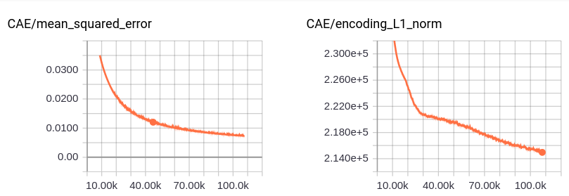
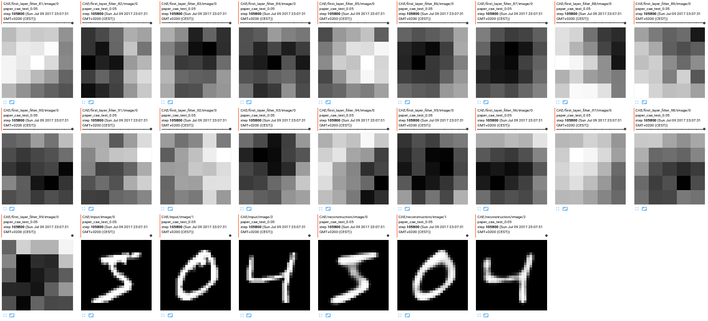

*MNIST CAE*

Convolutional autoencoder with 3 conv layers before the encoding layer. Same architecture as desribed in the paper. Experimental results will follow

First training results are:

Some first layer filters and digit reconstructions:

