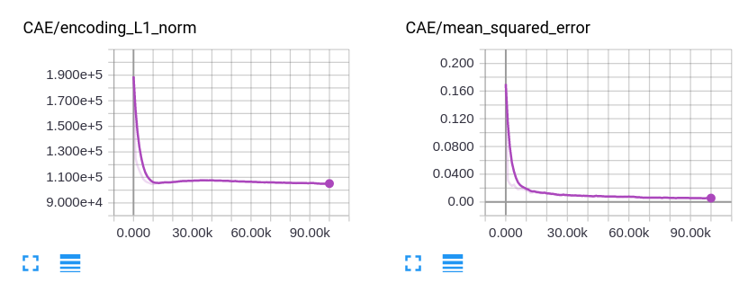

# CIFAR CAE

architecture as desribed in the paper (same as *MNIST* CAE but with 3 input maps)

first results after 100k iterations with batchsize 128, lr 0.5:

error and hidden representation L1 norm:

some example reconstructions:

some first layer filters:

