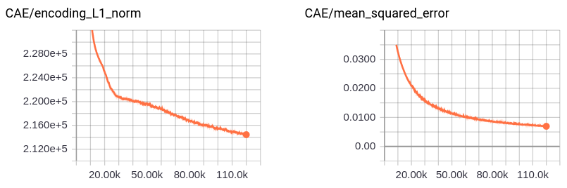
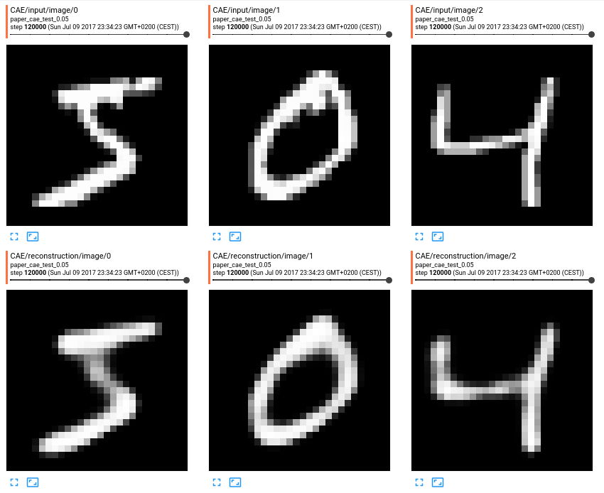

# MNIST CAE

Convolutional autoencoder with 3 conv layers before the encoding layer. Same architecture as desribed in the paper. Experimental results will follow

Training results after 120k iterations: 

Some example reconstructions:

Some first layer filters:

